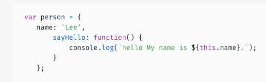

# 객체

 

## 객체란?
자바스크립트는 객체 기반의 프로그래밍 언어이며, 자바스크립트를 구성하는 거의 '모든 것'이 객체이다.
원시 값을 제외한 나머지 값(함수, 배열, 정규 표현식 등)은 모두 객체다.

 
객체는 0개 이상의 프로퍼티로 구성된 집합이며, 프로퍼티는 키와 값으로 구성된다. 
 

 
 
 
자바스크립트에서 사용할 수 있는 모든 값은 프로퍼티 값이 될 수 있다.
자바스크립트에서의 함수는 일급 객체이므로 값으로 취급할 수 있다. 따라서 함수도 프로퍼티 값으로 사용할 수 있다.
프로퍼티 값이 함수일 경우, 일반 함수와 구분하기 위해 메서드라 부른다.

 
 
- 프로퍼티: 객체의 상태를 나타내는 값(data)
- 메서드: 프로퍼티(상태 데이터)를 참조하고 조작할 수 있는 동작(behavior)
 
 
> 자바스크립트의 객체는 함수와 밀접한 관계를 가진다. 함수로 객체를 생성하기도 하며 함수 자체가 객체이기도 하다. 자바스크립트에서 함수와 객체는 분리해서 생각할 수 없는 개념이다. 즉, 객체를 이해해야 함수를 제대로 이해할 수 있고, 반대로 함수를 이해해야 객체를 정확히 이해할 수 있다.

